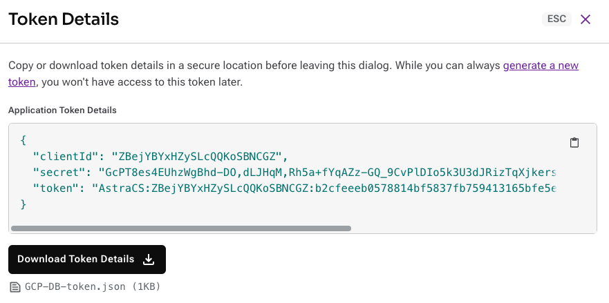
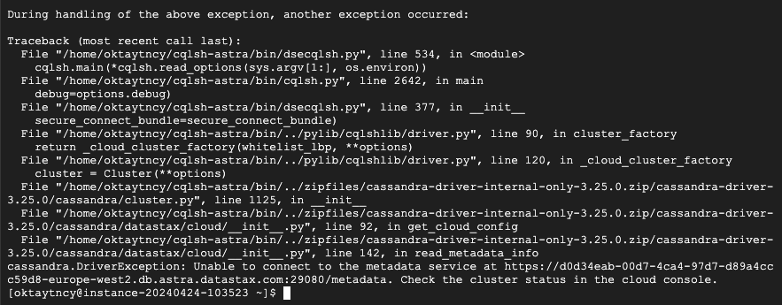
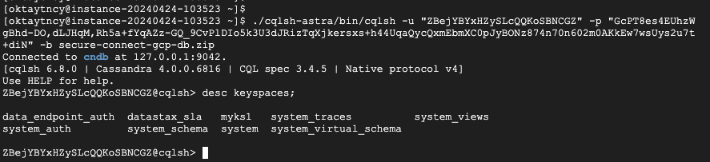

# Connect to Google Cloud private endpoints via Astra Portal

Private endpoints let you create a secure connection between your cloud provider and Astra DB in the same region as your serverless database instances. With a private endpoint, no information is sent over the public network.

I'll walk you through each step, ensuring you can securely and efficiently integrate these powerful tools in your own projects.

## Prerequisites

Before we start, let's go over some prerequisites that are necessary for setting up a private endpoint between AstraDB and GCP. 

<p align="left">
  
</p>

Before starting, confirming these steps will help avoid any setup issues as we proceed.

1. On the AstraDB side,
    1. First, ensure that you have the required permissions in AstraDB. 
        1. As displayed on the screen, you should be logged in with either an organization admin or database admin role. 
    2. Additionally, the database must be hosted in the same region where you intend to establish the private endpoint.
2. On the GCP side, there are several specific permissions and settings you need to verify before proceeding:
    1. First, you must have the necessary permissions to create network resources.
    2. You also need access to the GCP console. 
    3. Additionally, ensure that the Compute Engine API is enabled. For this, you must have a billing account on the GCP side.
        1. Enabling the Compute Engine API is a key step when managing private endpoints, because it allows the infrastructure to scale dynamically. This dynamic scaling is necessary to manage the workload efficiently, and this helps increase performance as well. 
    4. Finally, ensure that the Cloud DNS API is enabled and the Cloud DNS zone has been created on GCP.

Setting up the connection between Google Cloud and Astra DB private endpoints involves a few steps in both UIs.

### Configuration

Here's a quick look at the overview the database I set up earlier. It’s running in europe-west2 region.

<p align="left">
  
</p>

On the settings tab, when you click **Configure Region**, it will prompt you for a **Project ID**. This Project ID is the ID of the project you have created on GCP.

<p align="left">
  
</p>

When you switch to the GCP console and list my projects, you can copy the ID from the column on the login page.

<p align="left">
  
</p>

In my case, the ID I need to copy is; **astraendpoint**

When I return to the Astra console, I can now configure the region. After completing the configuration, copy the generated Service Name.

<p align="left">
  
</p>


Switch to GCP, search for network services, and click on **Private Service Endpoint.**

Let's set up the Connect endpoint in the dialog box, here's what you need to do step-by-step:

- **For the Target:** Select; Published service.
- **In the Target Service Field:** Paste the Service Name that you copied earlier from the Astra Portal.
- **For the Endpoint Name:** Give it a descriptive name so you can easily recognize it later.
- **Network Options:** Use the Network dropdown to pick a network.
- **Choosing a Subnetwork**: Select a subnetwork from the Subnetwork dropdown.
- **Selecting an IP Address:** Choose an IP from the IP address dropdown. 
    - If there is no IP address to choose, you can create it in a few seconds.

**Example:**

<p align="left">
  
</p>

The Region field auto-populates the region of your database based on the Service Name that you pasted into the Target service field. If the region is not what you intended, go back and check that you copied the Service Name from the correct database in the Astra Portal.

After filling in all the required fields, it will take a short time for the endpoint to be created. Once accepted, GCU UI will display data for the added endpoint. 

Once it's completed, click the linked name of your newly added Endpoint to display the details screen in the Google Cloud Console, and copy the **Private Service Connect** (PSC) **ID**.

<p align="left">
  
</p>

Back in the Astra Portal, return to the **Add Private Endpoint** dialog that's available from your database's settings and paste in the copied PSC ID value. 
*Optionally, you can enter a brief description.*

<p align="left">
  
</p>

Your private endpoint is defined. However, access to your database is still open to the public.

Let's take a short break here and try this with a test. I will attempt to connect to the database with cqlsh through an instance running on GCP. To perform this test, I will need AstraDB's database token and Secure Connect Bundle.

To do this, go to the Connect tab of your database in AstraUI. First of all, **Generate Database Token** and copy clientId and secret.

<p align="left">
  
</p>

Then, create a Secure Connect Bundle by selecting **Get Bundle.** You can either download it directly to your local machine or execute one of the provided URL, cURL, or WGET commands from the server you will connect to.

<p align="left">
  
</p>

Finally, we need to install the necessary binaries so that we can run the cqlsh command from the instance running in the GCP console.

For this, you can use the instructions on the <a href="https://docs.datastax.com/en/astra/astra-db-vector/cql/connect-cql-shell.html#:~:text=The%20Cassandra%20Query%20Language%20Shell,or%20the%20standalone%20CQL%20shell" target="_blank">docs.datastax</a>.

- To run the cqlsh script from the command line:
```bash
$ ./bin/cqlsh -u CLIENT_ID -p CLIENT_SECRET -b /SECURE_CONNECT_BUNDLE_PATH/secure-connect-DATABASE_NAME.zip
```

As you can see in the screenshot below, I was able to connect without any problems.

<p align="left">
  
</p>

After this test, go to the **Settings** tab of your database and enable **Restrict public access** and repeat the same test.

<p align="left">
  
</p>

In our experiment this time, we were unable to establish a successful connection to the database because the required configuration has not been completed yet.

To complete this, we need to return to the GCP console and configure Cloud DNS.

**Note:** Before doing this, we need to provide the DNS name information that will be requested during this configuration. We will need the host information from the config.json file within the secure-connect-bundle file you downloaded in the previous steps.

<p align="left">
  
</p>

If you have copied the host key's value from the config.json file, you can continue creating the DNS Zone as follows.

**Here is an example;**

<p align="left">
  
</p>

- Zone type: **Private**
- DNS name: host key's value from the config.json file
- Description: *Optional*
- Options: keep the default
- Networks: Network information to be used for this structure

After the zone is created, two DNS records of type SOA and NS will be created, but these two records are not sufficient to complete the configuration.

<p align="left">
  
</p>

- The SOA record contains essential information about a DNS zone, including the primary authoritative name server for the zone, the email address of the administrator responsible for the zone, and various timing parameters.
- NS records specify the authoritative name servers for a particular domain.

In addition to these two records, we need another record of type A.

A records map hostnames to IP addresses. They are used to point domain names to specific IP addresses. All these records are essential for directing traffic to the correct destination server or hosting provider.

To add a record of type A:
- Click **Add Standard**

All values on the page can be left as default (TTL can be changed if desired). 
The only key variable here is the IPv4 address, where the requested address is the IP information of the Endpoint defined in the previous steps.

<p align="left">
  
</p>

After adding the relevant line, we should see a view like the one below.

<p align="left">
  
</p>

After this step, we can try our test once again by returning to the SSH connection that received the error.

<p align="left">
  
</p>

Our test passed successfully, we have now established a completely secure connection between GCP and AstraDB.

Private endpoint connections allow you to connect to services privately from within your virtual network, thus keeping your traffic off the public internet. This significantly reduces the attack surface and helps prevent unauthorized access to your data and services.